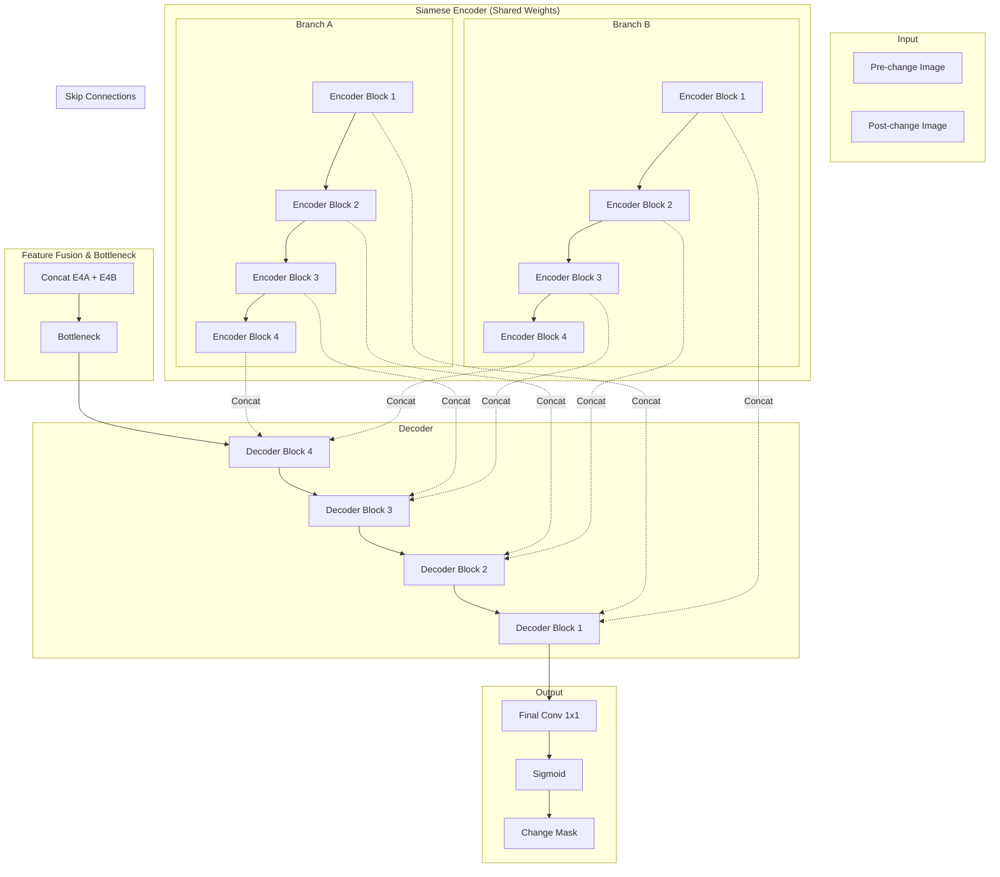

# Infrastructure Change Detection Using Satellite Imagery

## Project Overview
This project focuses on **infrastructure change detection** using deep learning models applied to satellite imagery. The primary goal is to identify and highlight changes between two satellite images of the same geographical area taken at different times (pre-change and post-change). This capability is crucial for various applications, including urban planning, disaster assessment, environmental monitoring, and land-use analysis.

The project implements and explores several deep learning architectures, with a strong emphasis on the **Siamese U-Net** for its effectiveness in bi-temporal image analysis. A Streamlit-based web application is also provided for an interactive demonstration of the change detection process.

## Features
*   **Multiple Deep Learning Models**: Implementation of Siamese U-Net, U-Net, U-Net with ResNet backbone, and LCDNet for change detection.
*   **Bi-temporal Image Analysis**: Specialized models designed to compare two images and identify subtle or significant changes.
*   **Streamlit Web Application**: An interactive and user-friendly web interface for uploading pre-change and post-change satellite images and visualizing detected changes.
*   **Automatic Preprocessing**: Images are automatically resized and normalized for model inference.
*   **CPU-Friendly Inference**: Optimized for efficient performance even on devices with limited computational resources.
*   **Segmentation Mask Generation**: Outputs a clear segmentation mask highlighting the areas where changes have been detected.

## Architecture: Siamese U-Net
The core of this project's change detection capability is the **Siamese U-Net** architecture. This model leverages two parallel U-Net-like encoder paths with **shared weights** to process the pre-change and post-change images independently. The features extracted from both images are then fused at various levels before being passed through a common decoder path to generate the final change segmentation mask.

This architecture is particularly effective because:
*   **Shared Weights**: Ensures that both images are processed with the same feature extraction logic, making the comparison more consistent.
*   **Feature Fusion**: Allows the model to learn differences and similarities between the bi-temporal images at multiple scales.
*   **U-Net Structure**: Provides robust segmentation capabilities by combining high-level semantic information with low-level spatial details through skip connections.

### Siamese U-Net Diagram


## Models Implemented
The project includes implementations and discussions of several change detection models:

*   **Siamese U-Net**: (As detailed above) Utilizes two parallel U-Nets with shared weights for robust bi-temporal image comparison. More details can be found in [`Siamese UNet/readme.md`](./Siamese%20UNet/readme.md).
*   **U-Net**: A standard U-Net architecture adapted for change detection. Known for its effective segmentation capabilities. More details can be found in [`UNet/readme.md`](./UNet/readme.md).
*   **U-Net with ResNet Backbone**: Enhances the U-Net by incorporating a ResNet backbone for improved feature extraction, leading to higher accuracy. More details can be found in [`UNet with RESNet/readme.md`](./UNet%20with%20RESNet/readme.md).
*   **LCDNet**: A lightweight deep learning model optimized for efficient change detection, particularly useful for resource-constrained environments. More details can be found in [`LCDNet/readme.md`](./LCDNet/readme.md).

## Deployed Website (Streamlit Application)
The `Deployed Website` directory contains a Streamlit web application (`app.py`) that provides an interactive interface for demonstrating the change detection using the Siamese U-Net model. Users can upload two images (pre-change and post-change) and receive a generated segmentation mask highlighting the detected changes.

### How to Run the Web Application
1.  Navigate to the `Deployed Website` directory:
    ```bash
    cd Deployed Website
    ```
2.  Install the required dependencies:
    ```bash
    pip install -r requirements.txt
    ```
3.  Ensure you have the `siamese_unet.pth` model file in the same directory. You can download it from the link provided in [`Siamese UNet/readme.md`](./Siamese%20UNet/readme.md).
4.  Run the Streamlit application:
    ```bash
    streamlit run app.py
    ```
    This will open the application in your web browser.

## Installation and Setup
To set up the project locally, follow these steps:

1.  **Clone the repository**:
    ```bash
    git clone https://github.com/your-username/Infrastructure-Change-Detection-Using-Satellite-Imagery.git
    cd Infrastructure-Change-Detection-Using-Satellite-Imagery
    ```
2.  **Create a virtual environment** (recommended):
    ```bash
    python -m venv venv
    source venv/bin/activate  # On Windows, use `venv\Scripts\activate`
    ```
3.  **Install dependencies**:
    The main dependencies for the Streamlit app are listed in `Deployed Website/requirements.txt`. For training notebooks, additional packages might be required. It's recommended to install them as needed when running the notebooks.
    ```bash
    pip install -r "Deployed Website/requirements.txt"
    ```
4.  **Download Pre-trained Models**:
    Pre-trained models for Siamese U-Net, U-Net, U-Net with ResNet, and LCDNet can be downloaded from the links provided in their respective `readme.md` files within the `Siamese UNet`, `UNet`, `UNet with RESNet`, and `LCDNet` directories.

## Usage
*   **Web Application**: Follow the instructions in the 
 `How to Run the Web Application` section above.
*   **Jupyter Notebooks**: Explore the Jupyter notebooks (`Siamese_Unet.ipynb`, `Unet and Unet Resnet.ipynb`) for detailed model training, evaluation, and experimentation. Ensure all necessary dependencies are installed for each notebook.

## Project Structure
```
Infrastructure-Change-Detection-Using-Satellite-Imagery/
├── Deployed Website/                  # Streamlit web application for inference
│   ├── app.py                         # Main Streamlit application script
│   ├── Procfile                       # For deployment (e.g., Heroku)
│   ├── readme.md                      # README for the deployed website
│   ├── requirements.txt               # Python dependencies for the web app
│   └── setup.sh                       # Setup script for deployment
├── LCDNet/                            # Implementation of LCDNet model
│   └── readme.md                      # README for LCDNet
├── Siamese UNet/                      # Implementation of Siamese U-Net model
│   └── readme.md                      # README for Siamese U-Net
├── UNet/                              # Implementation of standard U-Net model
│   └── readme.md                      # README for U-Net
├── UNet with RESNet/                  # Implementation of U-Net with ResNet backbone
│   └── readme.md                      # README for U-Net with ResNet
├── Siamese_Unet.ipynb                 # Jupyter notebook for Siamese U-Net training/evaluation
├── Unet and Unet Resnet.ipynb         # Jupyter notebook for U-Net and U-Net ResNet training/evaluation
└── README.md                          # Main project README (this file)
```

## Contributing
Contributions are welcome! Please feel free to open issues or submit pull requests.

## License
This project is licensed under the MIT License.

## References
[1] **Levir-CD Dataset**: [https://justchen.github.io/CVPR2020_CD/](https://justchen.github.io/CVPR2020_CD/)
[2] **Streamlit**: [https://streamlit.io/](https://streamlit.io/)
[3] **PyTorch**: [https://pytorch.org/](https://pytorch.org/)

